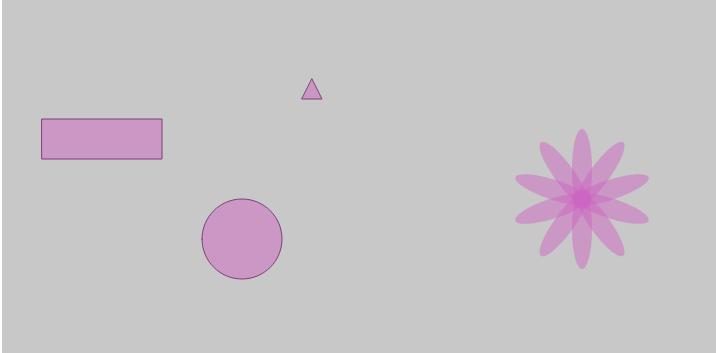
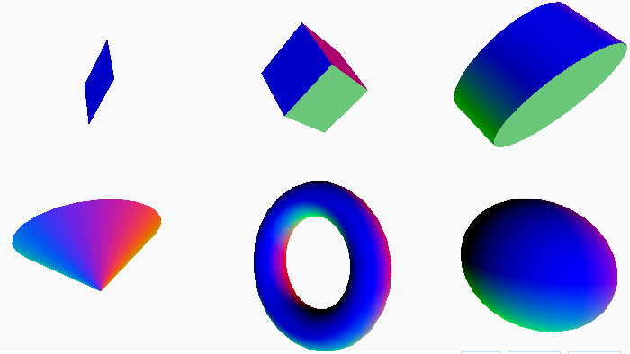
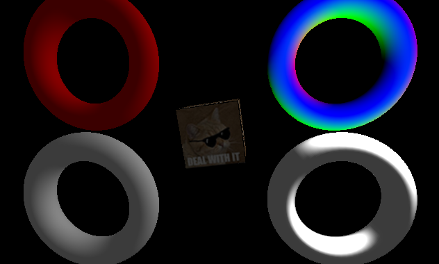

```{r setup, include=FALSE}
knitr::opts_chunk$set(echo = FALSE)
```

## p5.js

p5.js este o librarie JavaScript care reproduce functionalitatea lui Processing.

Pentru a intelege mai bine p5, trebuie sa stim de unde a pornit.

## Processing

Processing(2001) este un software si un limbaj de programare a artelor vizuale. Acest program:

- este OpenSource
- poate creea programe interactive cu output in 2D, 3D, PDF sau SVG.
- are integrare OpenGL pentru grafici 2D si 3D acelerate
- poate fii utilizat pe mai multe platforme(Gnu/Linux, MacOS, Windows, Android, ARM)
- peste 100 de librarii care extind programul de baza
- bine documentat si multe carti publicate

## Processing

Processing poate fii folosit impreuna cu alte limbaje pe programare;

- python
- Ruby
- JavaScript(p5)

## Dezvoltare

Pentru dezvoltarea siteului au fost folosite urmatoarele tehnologii:

- HTML/CSS
- JavaScript(p5.js)
- Bootstrap
- RMarkdown(ioslides)


## Cum functioneaza

Acestea sunt cele mai importante comezi care se regasesc in orice fisier:
```
function setup(){ // pregateste canvas-ul
  createCanvas(width, hegith);
}

function draw(){ // deseneaza formele pe canvas
  /* insert code here */
}
```
## Forme 2D

Libraria poate genera forme de la cea mai simple speta(2D)

- arc()
- ellipse()
- circle()
- line()
- point()
- rect()
- triangle()

## Forme 2D


## Forme 3D

pana la forme mai complexe(3D)

- plane()
- box()
- sphere()
- cylinder()
- cone()
- torus()

## Forme 3D



## Materiale

In generarea formelor poti fii folosite mai multe tipuri de materiale




## Evenimente

Libraria poate folosii evenimente precum:

- locatia mouseului (x & Y)
- apasarea mouseului
- tastatura
- orientarea dispozitivului

## Comenzi

- loadJSON()
- loadXML()
- httpGet()
- httpPost()
- httpDo()

## WebGl

p5 este capabil de a randa modele folosind si WebGl.

```
function setup(){
  createCanvas(100, 100, WEBGL);
}
```

## WebGL

pentru WebGL sunt numeroase comenzi pentru perspectiva precum:

- camera(x,y,z)
- perspective(fovy, aspect, near, far)
- ortho(left, right, bottom, top, near, far)